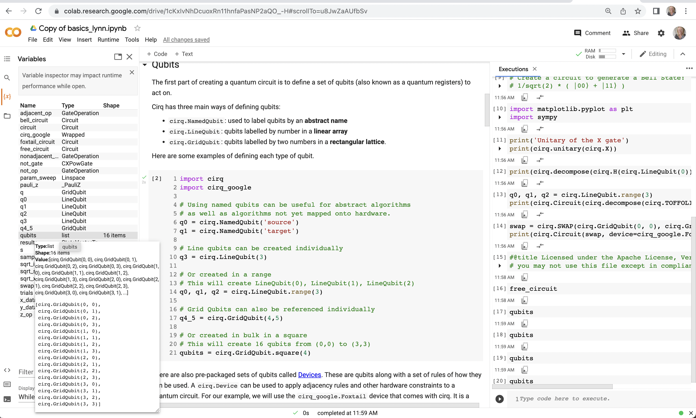

# GCP - Machine Learning

Google Cloud includes a number of services which are frequently used when building machine learning experiments and applications.  I've created a visualization to summarize most common usage below. Also, see the folded named `gemini_LLM` in this repo to view my notes and visualization of the recently released VertexAI Model Garden (which includes Google's LLM Gemini).

## Course

This repo is a companion to my LinkedIn Learning course 'GCP ML Essentials' - at https://www.linkedin.com/learning/google-cloud-platform-for-machine-learning-essential-training

This Repo section contains information and code samples/notebooks which use GCP Machine Learning / AI services.  

- In this Repo: GCP AI example notebooks &  scripts in folders in this repository
- GCP Repo: Big repo of many VertexAI samples (instructions and notebooks): https://github.com/GoogleCloudPlatform/vertex-ai-samples
- Google Research Repo: model tuning playbook: https://github.com/google-research/tuning_playbook
  
---

## Topic Areas

Google Cloud Platform Analytics and Machine Learning Samples for services shown below.  

Samples currently include the following:
 - **GCP Colabs** (Jupyter-style) notebook (example shown below)
    - for BigQuery (connect & run SQL queries)
    - for BigQueryML (connect, build, train and predict using ML model) IMPORTANT: Use link in each notebook to open it in GCP Colabs environment
    - for TensorFlow w/GPU - speed test  
    - for production workloads, you may want to pay for and use ColabPro ($10/mo) for faster GPU, longer notebook runtimes and more memory

 - **Scripts** and code samples 
    - for BigQueryML in SQL
    - Vision API
    - Natural Language API  
    - for AutoML Vision & Natural Language
    - for Datalab (Jupyter-notebooks on GCE)
    - for TensorFlow 
        - Docker image 
        - Virtual Machine image
        - MLEngine
        - TF Probability
    - Cloud TPUs
    
 ---

 - **Resources**
    - **Sample Data**  
      - GCP public datasets - https://console.cloud.google.com/marketplace/browse?filter=solution-type:dataset
      - TensorFlow Hub for Image, Text, Video (models + data) - https://tfhub.dev/
      - TF Datasets - https://www.tensorflow.org/datasets/catalog/overview
      - Google Dataset search - https://datasetsearch.research.google.com/
   - **Example Models**
      - GCP Vertex AI Model Garden - https://cloud.google.com/model-garden?hl=en
      - TensorFlow (Model) Hub - https://www.tensorflow.org/hub
      - TensorFlow Model Garden - https://github.com/tensorflow/models/tree/master/official
      - YouTube Adventures In The Cloud series - https://www.youtube.com/AdventuresInTheCloud
   - **Learning about APIs & Concepts**
      - Trying out DocumentAI - https://cloud.google.com/document-ai
      - Teachable Machines (teach kids AI) - https://teachablemachine.withgoogle.com/
      - End-to-end tutorial with ML tools - https://cloud.google.com/architecture/building-a-propensity-model-for-financial-services-on-gcp
      - Aweseome TensorFlow (list of currated links) - https://github.com/jtoy/awesome-tensorflow
      - Open source course on ML Foundations (homemade-machine-learning) - https://github.com/trekhleb/homemade-machine-learning
      - DeepMind Educational Resources (notebooks on Github) - https://github.com/deepmind/educational
    - **AI Ethics/Tools**
      - My Repo of links `ethical-AI` - https://github.com/lynnlangit/learning-ethical-ai
      - TensorFlow Responsible API - https://www.tensorflow.org/responsible_ai
      - TensorFlow Fairness Indicators - https://www.tensorflow.org/tfx/guide/fairness_indicators
      - Article - addressing bias in COVID-19 data - https://cloud.google.com/blog/products/ai-machine-learning/google-and-harvard-improve-covid-19-forecasts
      - Article - monitor models for drift - https://cloud.google.com/blog/topics/developers-practitioners/monitoring-feature-attributions-how-google-saved-one-largest-ml-services-trouble

 ---
 ## Setup

 To setup general prerequisites see the `SETUP.md` file in this Repo.

